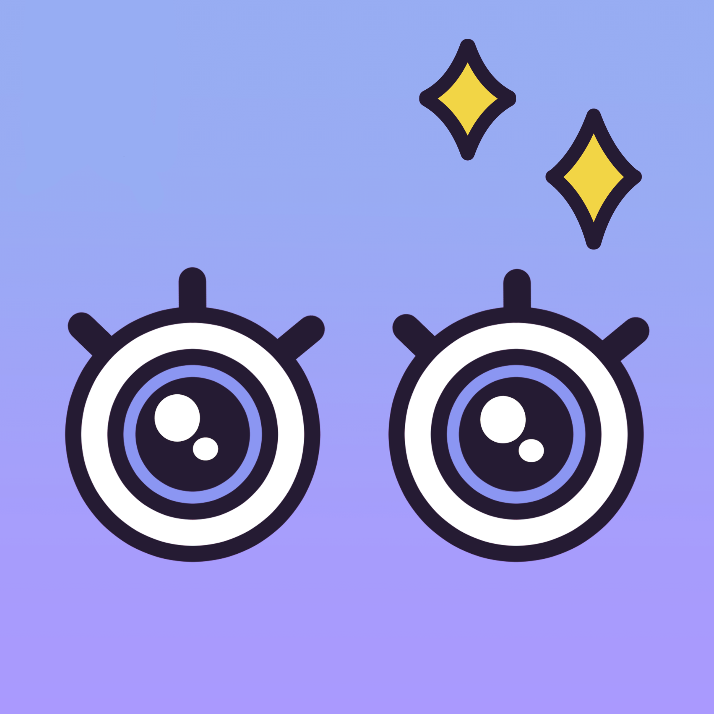
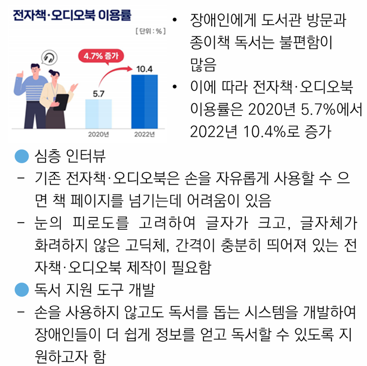
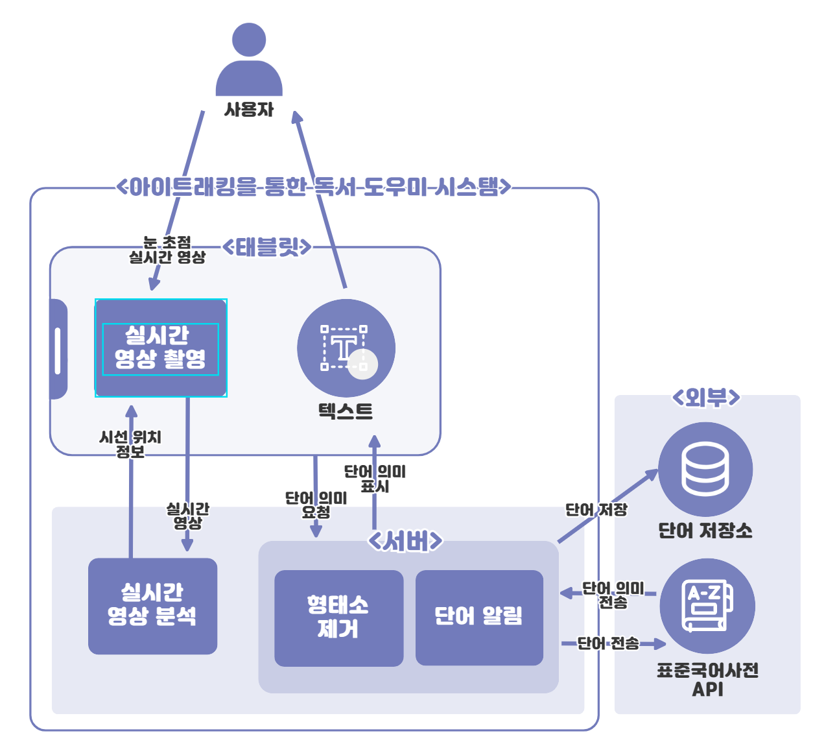
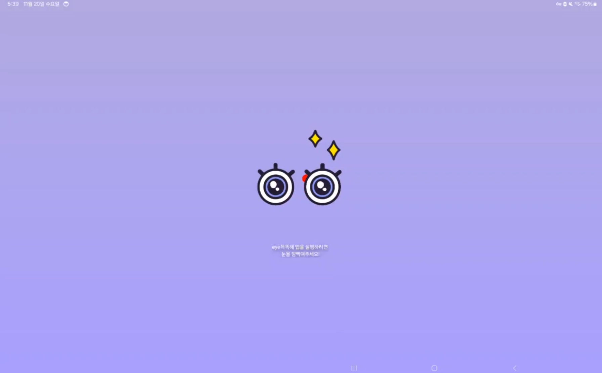
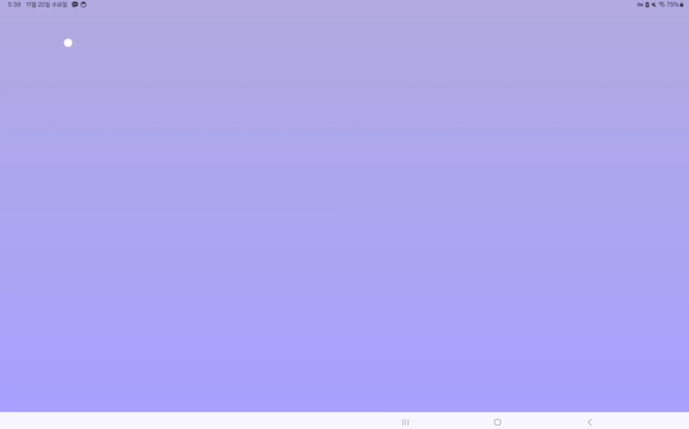
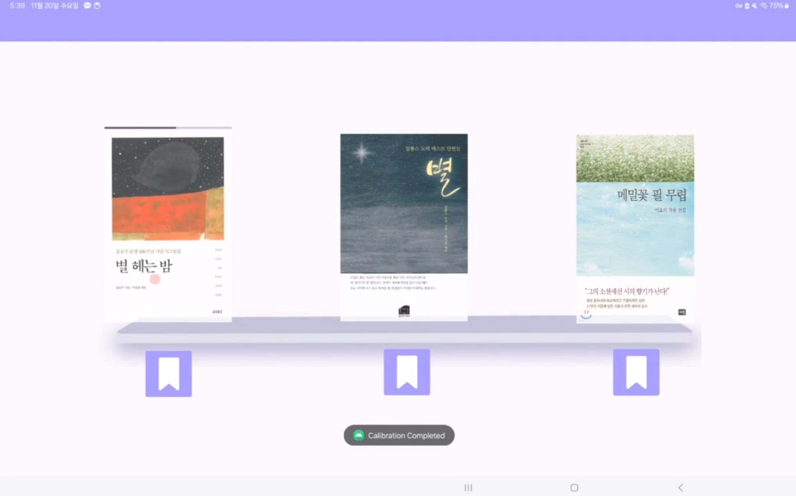
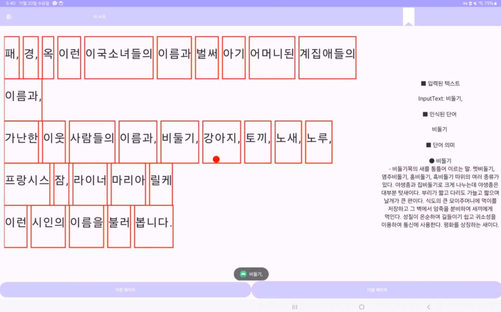

# 👁️‍🗨️EYE SMART👁️‍🗨️  
공학작품 전시대회 출품작  

  

---

## 📖 프로젝트 소개  
아이트래킹을 통한 독서 도우미 서비스  

 

EYE SMART는 사용자의 시선 추적을 기반으로 독서를 도와주는 서비스입니다. 간단한 시선 동작만으로 페이지를 넘기고, 특정 단어의 의미를 확인하거나 북마크를 저장할 수 있습니다.  
이 어플리케이션은 전자책 · 오디오북 이용이 어려운 사용자들의 접근성 향상과 즉각적인 단어 의미 제공을 통한 편리한 독서 읽기를 목적으로 하고 있습니다.

---

## ⏰ 개발 기간  
2024. 08 ~ 2024. 11. 21  

---

## ⚙️ 개발 환경  
- **IDE** : Android Studio  
- **language** : Java, Python  
- **Framework** : Flask  

---

## 📌 주요 기능  
**1. 시선 추적 기능**  
- 사용자의 시선을 추적하여 응시하는 위치를 화면에 나타냅니다.  

**2. 페이지 이동**  
- 이전 및 다음 버튼을 응시할 경우 페이지 전환이 이루어집니다.  

**3. 단어 의미 제공**  
- 사용자가 특정 단어를 응시할 경우, 해당 단어의 의미를 화면에 나타냅니다.  

**4. 북마크 기능**  
- 특정 페이지를 저장하여 불러올 수 있습니다.  

---

## 📄 설계  
  

---

## 📂 프로젝트 구조

├── app/                       
│   ├── src/                   
│   ├── res/                   
│   └── AndroidManifest.xml                   
├── assets/                   
├── LICENSE.txt                
└── README.md                 

---

## 🛠️ 사용된 기술  
- Frontend: Android (Java, XML)  
- Backend: Python (Flask, REST API), AWS  
- API: 한국어표준국어대사전 API, EYEDID SDK

---

## 🧑‍💻 멤버 구성  
- 이휘([0630hwi](https://github.com/0630hwi))  
- 성준서([JunSeo0702](https://github.com/JunSeo0702))  
- 김현우([babyhuynwoo](https://github.com/babyhuynwoo))  
- 박규나([Gyu-me](https://github.com/Gyu-me))  

---

## 사용 화면
  
  
  
  

---

## 🏆 수상 내역

- **대회명**: 2024 목포해양대학교 공학작품 전시대회

 

---

## 📜 License

This project is licensed under the **MIT License**. See the [LICENSE.txt](LICENSE.txt) file for details.

---

### 📦 Third-Party Libraries

This project makes use of the following third-party libraries:

1. **AndroidX AppCompat Library**  
   License: Apache License 2.0  

2. **Material Components for Android**  
   License: Apache License 2.0  

3. **OkHttp**  
   License: Apache License 2.0  

4. **AndroidX Activity Library**  
   License: Apache License 2.0  

5. **ConstraintLayout**  
   License: Apache License 2.0  

6. **JUnit**  
   License: Eclipse Public License 1.0  

7. **AndroidX Test Ext JUnit**  
   License: Apache License 2.0  

8. **Espresso**  
   License: Apache License 2.0  

9. **Eyedid Android SDK**  
   License: Eyedid SDK Trial License Referenced from [VisualCamp GitHub Repository](https://github.com/visualcamp/eyedid-android-sample)  
   Copyright © 2024 VisualCamp. All rights reserved.

For detailed information, refer to the [LICENSE.txt](LICENSE.txt) file.

## 🌍 Distribution
현재 이 프로젝트는 상업적 배포 계획이 없으며, 대회 발표 및 기술 데모 목적으로 개발되었습니다.
